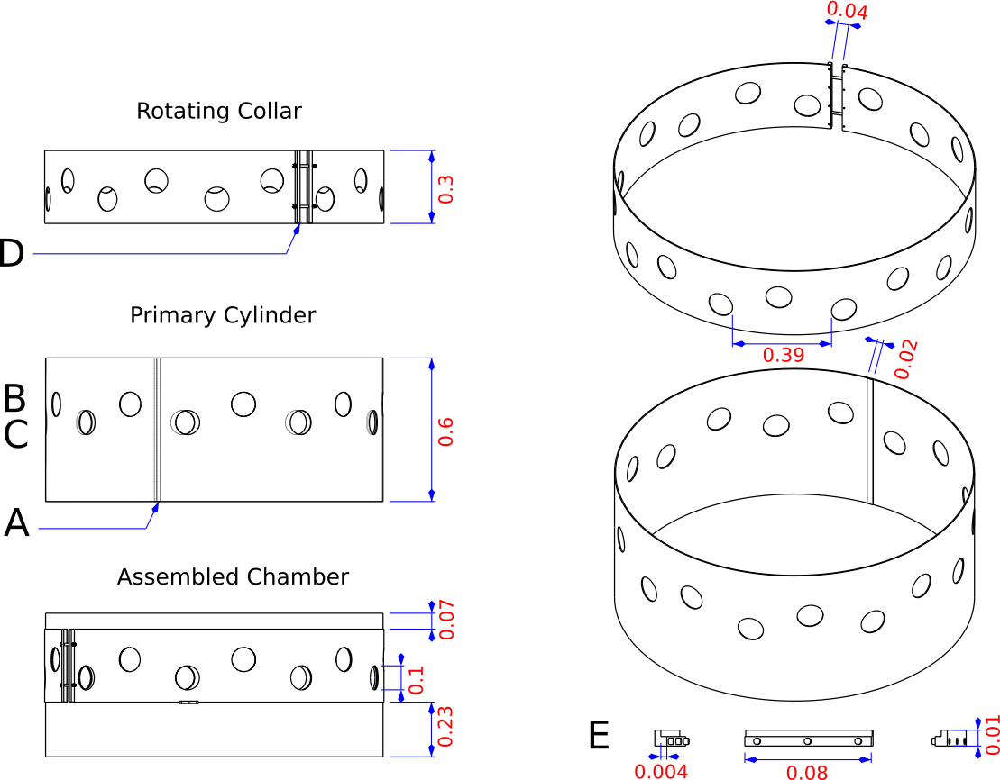

```{r setup, include=FALSE}
knitr::opts_chunk$set(echo = FALSE, fig.path = "../figures/", dpi=300, fig.height=3, fig.width=3, out.width="9cm")
```

## INTRODUCTION

Tide gauge records and satellite altimetry measurements clearly show evidence of global sea level rise (SLR) from the late 19th century to present (Church & White, 2011). In addition, recent modelling efforts have projected an increasing rate of global SLR into the future (Rahmstorf, 2007). One important aspect of SLR is that it is not uniform. Rather, the sea level experienced along a given coastal area is a function not only of the magnitude and acceleration of global sea levels but also their combination with regional ocean currents, teleconnection patterns, and patterns of glacial isostatic adjustment (Clark, Farrell, & Peltier, 1978; Park & Sweet, 2015). As a result, some locations may experience minimal SLR, whereas others could experience additional SLR of as much as 0.6 m by 2060 (Zhang, Dittmar, Ross, & Bergh, 2011). 
	\newline \indent Another important aspect of SLR is that its potential impact on coastal wetlands is a function not only of increased hydroperiods but also of elevated salinity (Spalding & Hester, 2007). Each of these mechanisms is likely to have specific effects on biogeochemical feed-backs, carbon cycling, and wetland plant adaptation (Herbert et al., 2015). In addition, there is likely to be spatial variability in the response of specific wetland processes to either increased hydroperiods, elevated salinity, or both. Overall, these knowledge gaps limit our understanding of spatial variability in SLR impacts, our ability to forecast these impacts on coastal wetlands, and our capacity to identify place-specific process thresholds (Cherry, McKee, & Grace, 2009).
\newline \indent Such knowledge gaps can be addressed in one of several ways. The first and most straightforward approach is passive monitoring of wetland elevation trends (e.g., Webb et al., 2013). Another approach for addressing SLR knowledge gaps is simulation modelling (e.g., Jiang, DeAngelis, Anderson, & Smith, 2014). However, both passive monitoring and simulation modelling approaches lack the power to confirm specific process thresholds unless paired with a suite of additional field-based studies. A final approach, which is the subject of this study, is experimental manipulation where a set of experimental “treatment” wetland units are exposed to SLR impacts and compared with a set of experimental “controls” (e.g., Cherry, Ramseur, Sparks, & Cebrian, 2015; Craft et al., 2016; Langley, Mozdzer, Shepard, Hagerty, & Patrick Megonigal, 2013; Lee, De Meo, Thomas, Tillett, & Neubauer, 2016, Rasser, 2009; Spalding & Hester, 2007).
\newline \indent These experimental manipulation approaches are especially powerful because they can provide a specific test of ecological mechanisms across many systems. In practice, these manipulations typically involve isolation of discrete sections of wetland sediment in order to directly lengthen wetland hydroperiods, elevate sediment porewater (interstitial) salinity, or a combination of the two. The physical setup for these manipulations ranges from very simple sediment filled buckets (Langley, McKee, Cahoon, Cherry, & Megonigal, 2009, Rasser, 2009) to more elaborate weirs \citep{cherry_testing_2015}, tiered cylinder designs (Langley et al., 2013), and electronically controlled saltwater distributions systems (Lee et al. 2016). 
\newline \indent The motivation for this study was to design an experimental manipulation approach that would alleviate two of our perceived short-comings of existing approaches. Namely, that existing approaches have primarily been laboratory based and that existing approaches have used relatively small sediment volumes (10–200 L) treated over a short time period (weeks—months). As a result, there is some question about whether or not experimental conditions in these prior studies adequately represent natural conditions and whether such short-term studies can be relied on to forecast SLR impacts which take place over the course of years to decades.
 \newline \indent With these concerns in mind, we designed a manipulation apparatus and experimental protocol with two major design goals (1) maximize the delivery and control of experimental salt doses while (2) introducing greater realism by maintaining experimental units in situ and minimizing disturbance to the local emergent plant and periphyton communities. Here, we describe the features of our design effort relative to our two major design goals. In addition, we report on some tests of our design using a case study set in the Florida Everglades. Our case study specifically tested the hypothesis that the sediment porewater salinity of enclosed wetland units could be elevated by repeated exposure to salt treatments. This work was completed as part of a larger study to examine the response of coastal peats to saltwater intrusion and to assess whether such intrusion disrupts soil carbon balance and leads to decreased soil structural integrity (i.e., peat collapse, Chambers et 
al., 2014;  CISRERP 2014, Troxler et al., In press).

## MATERIALS AND METHODS

### Mesocosm Design

Our mesocosm design was inspired by earlier work done by Newman et al.  (2004).  The  interior  (primary)  cylinder  of  each  of  mesocosm  enclosure  was  constructed  of  a  0.38  cm  ×   0.6  m  ×   4.3  m  sheet  of  clear  polycarbonate formed into a 1.4 m diameter cylinder (enclosing approximately  1,000  L)  using  adhesive  sealant  (Figure  1a).  Nine  10  cm  holes  were drilled in the side of each cylinder located 40 cm above the bottom (Figure  1b)  and  30  cm  above  the  bottom  (Figure  1c)  to facilitate  water  exchange during high and low water periods respectively (Figure 1c). 

```{r fig.cap="Mesocosm chamber technical diagram showing (a) the primary cylinder seam, (b) upper water exchange holes, (c) lower water exchange holes, (d) collar locking device, and (e) vertical alignment brackets. Labelled units are in metres", out.width="9cm"}

```

The  primary  cylinders  were  fitted  with  rotating  polycarbonate  collars  (0.3  m  height)  having  holes  drilled  at  the  same  size  and  alignment as the primary cylinder. In effect, this gave us the ability to rotate the  collar  to  “close”  the  mesocosm  when  delivering  a  salt  dose  and  to “open” the mesocosm to facilitate water exchange. Each collar was fitted with a locking device that could be tightened to ensure minimal surface water exchange during closure (Figure 1d). The locking device was constructed by attaching a high-density plastic (white Starboard) “handle” on either side of a vertical gap in the collar. Two sets of holes were  drilled  through  each  handle  and  fitted  with  long  stainless  steel  bolts. The collar could then be loosened via wing nuts attached to each bolt, rotated to either the open or closed position, and re-tightened to 
lock into place. The vertical position of the collar was maintained via four external “brackets” attached to the exterior of the primary cylinder  (Figure  1e).  Each  bracket  was  constructed  of  high  density  plastic  (white Starboard) with a “groove” to hold the rotating collar.
\newline \indent In an effort to maximize reproducibility, we have made our CAD model  used  to  construct  Figure  1  publicly  available  at  https://doi.org/10.5281/zenodo.1117118.  These  files  can  be  opened  in  to  inspect  additional  features  of  our  design  such  as  placement  of  hardware attachments. We have also included a parts list with additional details  regarding  dimensions,  material  quantities,  and  material  dimensions of each mesocosm part (Table 1).

### Saltwater delivery protocol

We  anticipate  that  most  study  designs  will  include  “treatment”  mesocosms,  which  are  “dosed”  with  a  saltwater  treatment  at  regular intervals, and “control” mesocosms, which are exposed to an ambient water (fresh or brackish) treatment. The exact details surrounding delivery of these saltwater doses will be dependent on  the  layout  and  location  of  each  study  site.  For  example,  saltwater additions in the experimental manipulations by Craft et
al. (2016)  were  directly  pumped  from  an  adjacent  tidal  inlet.  Given  that such a setup is not feasible in all situations, we developed a method to deliver portable salt doses irrespective of nearby saltwater sources. Briefly, our protocol makes use of locally sourced 
freshwater or brackish water combined with a commercial aquarium  salt  mix  (Instant  Ocean,  Blacksburg,  VA,  USA)  prepared  in  400 litre tanks (see Lee et al. 2016 for a similar approach). Rather than  adding  an  exactly  prescribed  saltwater  dose,  we  devised  a  dosing schedule, which was based on water levels and salinity at each  site,  by  solving  the  following  series  of  mass  balance  equations for the volume of dose-
water to be added to each mesocosm (Vb):

\begin{equation}
  \begin{aligned}
S_{f} = \frac{M_{a} + M_{b}}{V_{a} + V_{b}}\\
M_{b} = S_{b} x V_{b}
       \label{eqn:example} 
  \end{aligned}
\end{equation}

where Sf represents the final salinity of the on-site (ambient) and dose water mixture, whereas Ma and Va represent the salt mass (g) and volume (L) of the ambient water within each mesocosm. Variables marked with the subscript b represent equivalent components of the dosing water volume. For example, at one of our case study sites (see below), we fixed Sb
 at 55 and Sf at 20. We could  then  solve  the  above  set  of  mass  balance  equations  by 
adjusting  the  dosing  water  volume  (Vb).  The  rationale  for  our  simple  mass  balance  approach  is  that  we  assume  our  ambient-dose water mixture simple replaces existingporewater as a result of density-driven flow rather than accounting for convective 
diffusion.
\newline \indent We  delivered  saltwater  additions  to  the  treatment  mesocosms  and  ambient  water  additions  to  control  mesocosms  from  elevated  boardwalks   running   alongside   each   mesocosm   (Figure   2a).   We   used a submersible bilge-style pump (Rule, Xylem Inc., USA) to deliver doses at a maximum rate of approximately 32 l/min (500 gph). However, the actual flow rate was likely less given the distance and flow restrictions imposed by the dosing apparatus. The outlet hose was fitted with a spreader device, which was constructed by drilling holes into a short length of Polyvinyl chloride (PVC), in order to split the large output stream into twelve smaller streams. This design was intended to maximize mixing with ambient site water while minimizing scouring of sensitive benthic periphyton. Finally, emergent plants were  briefly  sprayed  with  ambient  water  following  dosing  to  avoid  
burn from salt spray.

## CASE STUDY

We  tested  our  mesocosm  design  and  experimental  protocol  in  a  case  study  at  two  sites  within  Everglades  National  Park,  Florida,  USA. One site was located within an area of freshwater wetlands, whereas  the  second  site  was  located  within  an  area  of brackish  wetlands.  Neighbouring  water  level  monitoring  gauges  indicate  that the freshwater and brackish wetland sites have annual hydro-periods of approximately 312 and 184 days respectively. Patterns of  inundation  at  each  site  were  intermittent  but  not  synced  on  a  regular (e.g., tidal) cycle. 
\newline \indent At each site, we deployed a total of 12 mesocosm chambers by inserting  them  approximately  15  cm  into  the  sediment  (Figure  2b).  We  used  an  unbalanced  design  that  included  6  salt-treated  mesocosms, 6 control mesocosms (treated with ambient site water), and 4 nonchamber control plots. The purpose of the nonchamber controls was to assess whether the chambers themselves influenced the experimental units over time. 
\newline \indent We assessed the overall performance of our mesocosm design and dosing protocol at three points in time following each monthly dosing event: immediately following dosing, the following day, and 5    days  post  dosing.  Our  primary  metric  for  assessment  was  the  relative difference in soil porewater salinity in salt-treated chambers versus control (treated with ambient water) chambers the day after dosing. To this end, we installed three porewater wells (i.e., “sippers”) within the interior of each chamber and two porewater wells on the outside of each chamber (Figure 2c). Wells were constructed of 1-m sample tubes inserted to a depth of 15 cm. Sample tubes  were  constructed  of  flexible  Tygon®  tubing,  sealed  with  teflon  tape,  and  protected  with  a  slotted  PVC  sleeve.  Sampling  took place for salinity, temperature, and pH via handheld probes (YSI, Inc.) by purging one length of the sipper tubing and collecting  duplicate  samples. 

```{r fig.cap="Site photographs showing (a) elevated dosing boardwalks, (b) close-up of deployed mesocosm, and (c) sampling well installation"}

```

We present the results of samples collected the day after dosing because we expected that this was long enough to ensure that any flow down the sides of the installed sampling apparatus would be  mixed  with  the  surrounding  porewater  but  not  so  long  that  porewater would be excessively diluted. We quantified postdosing salt retention/dilution in more detail as part of a pilot experiment. 
This  pilot  experiment  involved  outfitting  a  single  mesocosm  with  a more comprehensive array of porewater wells at many different distances  and  sampling  at  a  finer  temporal  resolution.  Here  we  present  the  results  of  our  mesocosm  design  and  monthly  dosing 
protocol tests over a yearly period from October 2014 to October 2015.

## RESULTS

We  found  that  our  long-term  dosing  experiment  was  successful  in  raising  porewater  salinities  above  ambient  (Figure  3).  At  the  fresh-water  wetland  site,  the  salinity  of  the  porewater  was  2.9  ±   0.8  and  0.3  ±    0.1  for  the  treatment  and  control  chambers  respectively  (Figure  3a).  At  the  brackish  wetland  site,  the  salinity  of  the  porewater  was  15.3  ±    1.9  and  10.3  ±    1.9  for  the  treatment  and  control  
chambers respectively (Figure 3b). We observed few differences between our control mesocosm chambers and our nonchamber control plots  (Figure  3).  This  suggests  that  the  mesocosms  by  themselves  were not directly impacting the experimental units with respect to porewater salinity. Our results were consistent with our hypothesis that indeed the porewater salinity of enclosed wetland units can be elevated by repeated exposure to salt treatments.

```{r fig.cap="Difference between treatment, control, and nonchamber-control porewater salinities at our (a) freshwater wetland site and (b) brackish wetland site"}

```

```{r fig.cap="Fine-scale dilution profile of salt additions to a treatment mesocosm"}

```

```{r fig.cap="Comparison between porewater salinity measured in the outside and inside-chamber sampling wells at the freshwater and brackish wetland sites. Treatment and control measurements are coloured following Figure 3"}

```

Although our design was successful in raising the porewater salinity of our treatment mesocosms over the long-term, the results of our pilot study indicate that a typical salt dose is contained within the sediment porewater of our chambers for only about 5 days, returning to approximately background levels at that point (Figure 4). Despite  the  fact  that  porewater  salinities  following  individual  salt  doses  remained  elevated  for  a  relatively  short  time  period,  our  mesocosm  design  was  successful  in  minimizing  the  movement  of  
saltwater  additions  through  the  chamber  walls  (Figure  5).  At  both  the freshwater and brackish wetland sites, although porewater salinity  measured  in  the  outside
  wells  of  the  treatment  mesocosms  was  slightly  elevated  above  ambient,  there  was  no  discernable  difference between the outside and inside porewater well salinity measurements  in  the  control  chambers.  In  contrast  to  anecdotal  reports from previous studies, our control chambers were not contaminated with salt.

## DISCUSSION

We  believe  our  mesocosm  design  and  experimental  protocol  met  our  design  goals  of  (1)  maximizing  delivery  and  control  over  experimental  salt  doses  and  (2)  introducing  greater  realism  to  experimental manipulations. In the following discussion, we identify  the  specific  features  of  our  design  that  serve  to  meet  these  design goals while contrasting our design choices with that of prior studies.

### Simulation effectiveness

In  our  view,  the  primary  requirement  of  an  effective  mesocosm  design  is  that  salt  additions  are  contained  within  experimental  treatment units as much as possible and do not “leak” into the surrounding  environment.  Although  the  performance  of  our  design in  this  respect  was  not  perfect  (i.e.,  our  mesocosms  did  not  perfectly  contain  salt  additions),  the  extent  to  which  our  mesocosms  were  successful  in  elevating porewater  salinity  in  the  treatment  mesocosms  suggests  that  our  design  was  largely  effective.  For  example,  in  our  brackish  wetland  treatment  we  observed  that  our mesocosms maintained elevated porewater salinities around 15 approximately  24  hr  after  dosing  when  surface  water  salinities  had  been around 20. Surprisingly, few prior studies have reported porewater  salinity  measurements  in  their  experimental  units  relative  to  dose  (surface  water)  salinity.  One  exception  is  Lee  et  al.  (2016) where  they  report  adding  an  experimental  dose  with  a  salinity  of  around 10 and measuring porewater salinities of <3. In some ways, both  our  findings  and  the  findings  of  Lee  et  al.  (2016)  are  a  consequence of an in situ design where vertical porewater movement is unbounded rather than a laboratory-based experimental design where doses are wholly contained. \newline \indent We  attribute  some  of  the  exceptional  salt  retention  properties of our mesocosms (e.g., there was little evidence of elevated salinity outside experimental units) to the rotating collar feature of our design. When our rotating collars were in the closed position  the  water  exchange  holes  were  completely  sealed.  The  evidence for this is that we did not observe elevated salinity in the surface  water  outside  the  chambers  or  contamination  of  control  plots  with  salt  (Figure  5).  We  know  from  anecdotal  reports  that  mesocosms  constructed  using  alternative  designs  where  water  exchange  holes  are  merely  plugged  with  rubber  stoppers  (e.g.,  Miller, Neubauer, & Anderson, 2001) are subject to much higher probability  of  observing  elevated  salinity  outside  experimental  units (i.e., salt leakage). It is difficult to gather information on this design  aspect  (potential  leakage)  of  prior  studies  because  it  is  most often not reported.

### Simulation realism

In  addition  to  faithfully  containing  salt  additions  within  experimental units, we believe that a primary requirement of an effective  mesocosm  design  is  a  high  degree  of  simulation  realism.  To  this  end,  our  open  bottom  in  situ  design  was  meant  to  simulate  slow buildup of salt in the surficial groundwater as a result of SLR while maintaining natural drainage conditions. Indeed, the pulsed nature of our salt additions meant that elevated porewater salinity  was  maintained  for  only  about  5  days  and  was  not  constant.  
This  variability  contrasts  with  the  design  of  many  laboratory-based  studies  that  completely  isolate  experimental  units  to  impose a constant salt treatment (Brock, Nielsen, & Crossle, 2005; Langley et al., 2013). Although constantly elevated salinities may 
be preferable to maximize treatment effects in the short-term, we designed  our  experimental  protocol  to  more  realistically  mimic  the  impact  of  gradual  and  episodic  ramping  of  salinity  over  the  long term (years to decades). Ultimately, our design likely comes 
at  the  cost  of  longer  times  necessary  to  observe  a  salt  dose  response, but we believe this is preferable to short-term simulations where experimental units are completely isolated leading to rapid salt accumulation.
\newline \indent Our  expectation  that  near-term  changes  in  SLR  will  cause  variable
 and episodic increases in the salinity of shallow porewater and wetland  plant  root-zones  is  supported  by  several  lines  of  observational and experimental evidence. First, in karst or low tidal systems, the response of coastal wetlands to SLR during the transition from
a vegetated to open water state can be dependent on variability in seasonal  groundwater-
surface  water  exchange  (Saha  et  al.,  2012).  Second, Weston, Vile, Neubauer, and Velinsky (2011) describe how saltwater intrusion in wetland soils likely occurs in pulses rather than as a constant steady increase. Finally, Craft et al. (2016) specifically 
contrasted wetland responses to constant (press) and variable (pulse) salinity doses and found that although pulsed doses were transient and  short-lived,  there  were  significant  impacts  on  the  composition  of the emergent plant community.
\newline \indent Another  way  in  which  our  pulsed  design  maintains  a  high  degree   of   simulation   realism   is   the   fact   that   our   chambers   retained a natural assemblage of flora and fauna. We view this as a  substantial  improvement  over  previous  designs  because  biotic  processes have been shown to be critical components of wetland resilience  to  SLR  (McKee,  2011;  Morris,  Sundareshwar,  Nietch,  Kjerfve, & Cahoon, 2002). There are three features of our design that made this possible and set it apart from prior studies. First, our mesocosm chambers were large. Our 1000 L mesocosm chambers are much larger than most previous studies of only 10–200 L. In our study, this meant that all of our experimental units at the brackish wetland  site  included  intact  sawgrass  (Cladium  jamaicense)  culms and we frequently observed fauna such as mosquitofish (Gambusia holbrooki) moving freely into and out of the chambers (in the open position)  at  the  freshwater  wetland  site.  Second, we  took  several  steps in the experimental protocol to minimize our impact on flora and  fauna  including  rinsing  emergent  plants  following  dosing  to  avoid  burn  from  salt  spray,  monitoring  soil  redox  conditions  to  avoid   introducing   severely   anoxic   conditions   that   exacerbate   sulphide  stress,  and  regulating  the  velocity  of  dose  output  to  avoid scouring of sensitive benthic periphyton. Finally, the in situ nature of our design likely increased the realism of our simulations because  it  minimized  physical  disturbance  of  below-ground  root  material in our experimental units.

## CONCLUSIONS

Ultimately, a successful SLR manipulation design requires a balance of simulation effectiveness and simulation realism. We believe that our rotating collar design gave us a unique ability to strike this balance  as  we  were  effective  in  containing  salt  additions  while  maintaining the conditions necessary for realistic drainage patterns and 
intact biotic communities.
\newline \indent We  tested  our  mesocosm  design  and  experimental  protocol  in two locations during our case study. Unfortunately, a comprehensive  test  of  our  design  in  many  different  settings  is  beyond  the scope of this study. However, our design is not limited to the Everglades system. We envision that our design could be used in a variety of settings including those that experience regular daily tidal cycles. In particular, the height of our chambers could easily be  increased  at  sites  where  mean  high  water  exceeds  the  total  installed  chamber  height  of  our  design  (about  0.3  m).  Although  regular  daily  tidal  cycles  were  not  a  feature  of  our  case  study, water  levels  were  below  the  sediment  surface  throughout  the  late spring period. During these periods we added a standard salt dose volume in proportion to an estimate of sediment pore space volume (soil porosity). In fact, the study by Craft et al. (2016) adopted  a  similar  approach  in  a  location  subject  to  daily  tidal  cycles when they added salt doses only during low tide to facilitate infiltration.
\newline \indent We  hope  that  our  design  will  inspire  others  to  initiate  similar  studies in a variety of geographical settings. Whether with our proposed  design  or  some  other  design,  a  standardized  methodology  would likely help reduce some of the general uncertainties regarding  prediction  of  coastal  wetland  sensitivity  to  SLR  and  saltwater  intrusion.

## Author Affiliations 

Per common academic best practice, you can include your department,
institution, and complete address, with the ZIP/postal code, for each
author. Use lower case letters to match authors with institutions, as
shown in the example. Authors with an ORCID ID may supply this
information at submission.

## Document Options

We support several options via the YAML header

- Setting a DOI or URL footer, for example for the CRAN package URL,
  which is placed in the bottom-left footer of the title page and even pages;
- Setting a footer label, for example _YourPackage Vignette_ stating
  your package, which is placed in the bottom-right footer on odd
  pages;
- Setting a free-form author field used on the inside footer;
- Optional _Draft_ watermarking;


## References 

Here we differ from PNAS and suggest natbib. References will appear in
author-year form. Use `\citet{}`, `\citep{}`, etc as usual.

We default to the `jss.bst` style. To switch to a different bibliography
style, please use `biblio-style: style` in the YAML header.

## Digital Figures 

Markdown, Pandoc and LaTeX support `.eps` and `.pdf` files.

Figures and Tables should be labelled and referenced in the standard way
using the `\label{}` and `\ref{}` commands.

```{r eval=FALSE}
kableExtra::kable_styling(
knitr::kable(head(mtcars), 
         format = "latex", booktabs = TRUE, caption = "demo"), 
         latex_options = "hold_position")
```

One (roundabout) way of doing this is to _not_ actually plot a figure, but to
save it in a file as the following segment shows:

<!-- pandoc writes all tables using longtable, which fails in 2-column mode

  Species                    CBS     CV     G3
  ----------------------- ------ ------ ------
  1\. Acetaldehyde           0.0    0.0    0.0
  2\. Vinyl alcohol          9.1    9.6   13.5
  3\. Hydroxyethylidene     50.8   51.2   54.0

  : Comparison of the fitted potential energy surfaces and ab initio
  benchmark electronic energy calculations

-->

