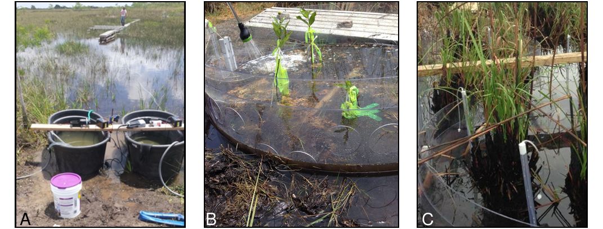
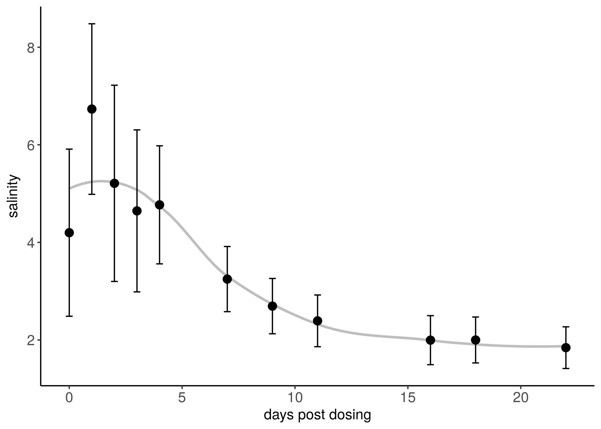
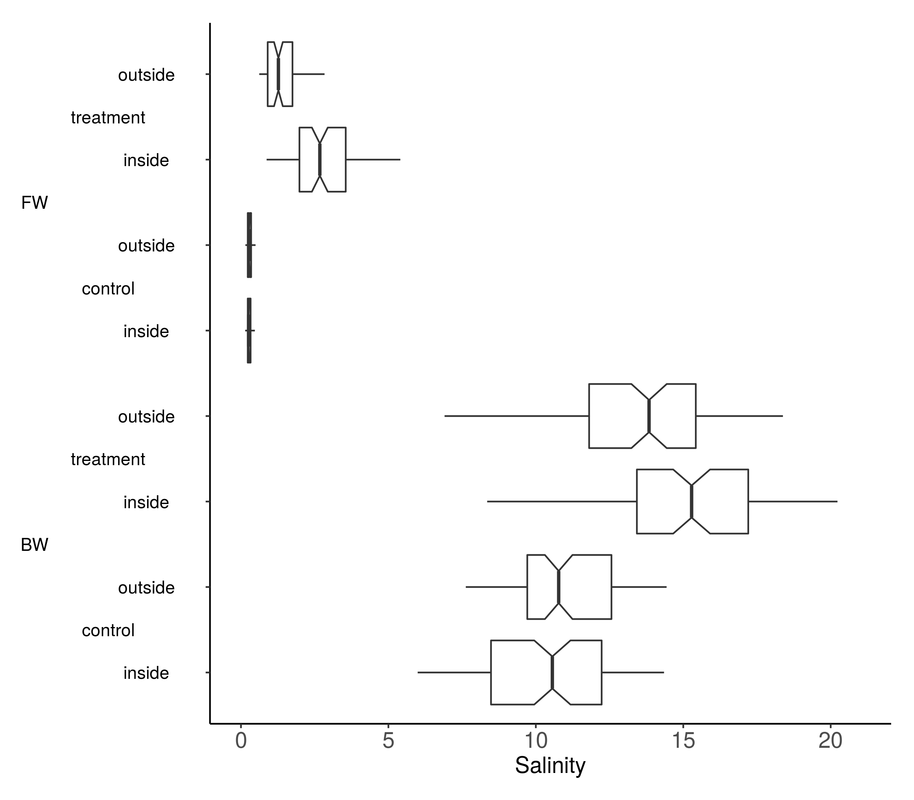

```{r echo=FALSE}
library(captioner)
fig_nums <- captioner()
table_nums <- captioner(prefix = "Table")
```

#Introduction
Tide gage and sattellite altimetry records clearly show evidence of global sea-level rise (SLR) [@church_2011]. In addition, estimates of global sea-level rise acceleration predict that sea levels in South Florida will continue to rise an additional 0.6 m by 2060 [@zhang_2011]. This has significant implications for the health, stability, and composition of coastal wetlands in the face of increased hydroperiod and alterations of biogeochemical cycling. While experimental evidence suggests that increasing wetland hydroperiod can lead to conversion to open water, rates of vertical soil accretion in mangrove and salt marsh wetlands have historically kept pace with rates of SLR (@morris_2002; @mckee_2011). Ultimately, the capacity of plants to increase their below belowground root production in response to increased inundation is unknown but likely limited. 

Our ability to forecast the net result of sea-level rise on coastal wetlands depends not only on an accurate accounting of geographically variable local rates of sea-level rise [@park_2015] but also the nature of biogeochemical feedbacks [@weston_2011]. For the purpose of this paper our aim is not to discuss the hyroperiod aspect of SLR but rather to focus on investigating changes in biogeochemical processing relative to increased salinization of wetland sediments. One biogeochemical pathway of particular concern is soil carbon balance. Examples of processes impacted by salinization and inundation while also affecting the soil carbon balance include soil redox potential, soil respiration, and osmotic stress to vegetation. We have working models of how these processes will be affected by SLR but there are significant gaps in our understanding of thresholds and characterization of geographic variation.
<!---[@webb_2013]. --->

Several field experiments have been conducted, are underway, or are planned to reduce uncertainties in these models through experimental manipulation. The design of such an experiment generally involves comparisons between an isolated set of salt-treated sediment volumes and a set of control sediment volumes. Experiments to date have used a variety of devices to isolate wetlands soils during experimental manipulation including marsh organs [@adam_2013], weirs [@cherry_2015], and mesocosms [@craft_2015]. Here we describe a variant of an in-situ mesocosm design to investigate biogeochemical effects of introduced saltwater in freshwater and brackish wetlands.

#Materials and Methods

This study takes place within Everglades National Park, Florida, USA at two sites. One site was located within an area of freshwater wetland where vegetation was composed of a mix of _Eleocharis cellulosa_ and _Cladium jamaicense_. Several stands of _Taxodium distichum_ were located nearby but outside the plot. The second site was located within an area of brackish wetland  where vegetation was composed of _Cladium jamaicense_. Mangroves were commonly observed nearby but outside the plot. Neighboring water level monitoring gages suggest that the freshwater and brackish wetlands sites have annual hydroperiods of approximately 312 and 184 days respectively.

##Mesocosm Design
Each of our mesocosm enclosures were constructed of a 0.6 x 4.3 m sheet of clear plastic formed into a 1.4 m diameter cylinder using a combination of adhesive sealant and pop rivets. A series of 10 cm holes were drilled in the side of each cylinder in order to facilitate water exchange. The primary cylinders were fitted with rotatating plastic collars having holes drilled at the same size and alignment. In effect, this gave us the ability to rotate the collar to "close" the mesocosm when delivering a salt dose and "open" the meoscosm to facilitate water exchange. Each collar was fitted with a locking device that could be tightened to ensure minimal surface water leakage.

```{r echo=FALSE, fig.align='center'}
fig_nums("chambers","Mesocosm chamber technical diagrams.",display = FALSE)
library(png)
library(grid)
#img <- readPNG("images/chambers.png")
#grid.raster(img)
```

**`r fig_nums("chambers")`**

##Saltwater Delivery

We contructed a total of twelve 1.4 m diameter plastic mesocosm chambers to be deployed at each wetland plot. Chambers were inserted approximately 30 cm into the sediment by striking a piece of wood laid on top of the chambers with a sledgehammer. On occasion, the presence of dense belowground root material required the use of hand saws.

Half of the mesocosms were designated to be exposed to a salt treatment made up of a mixture of on-site water and a commercial aquarium salt mix (Instant Ocean, Blacksburg, VA, USA). The volume and salinity of this salt dose was adjusted based on ambient conditions at the study sites. 

```{r site-diagrams, echo=FALSE, fig.align='center',fig.height=2.5}
fig_nums("site-diagrams","Site diagrams.",display = FALSE)
#img <- readPNG("figures/site-diagrams.png")
#grid.raster(img)
```

**`r fig_nums("site-diagrams")`**

Salt doses were delivered from elevated boardwalks running alongside each chamber. We used a submersible bilge-style pump to deliver the dose at a maximum rate of approximately 32 liters per minute (500 gph). The actual flow rate was likely less given the distance and flow restrictions imposed by the dosing apparatus. Specifically, the outlet hose was fitted with a spreader device in order to split the large output stream into six smaller streams. This design was intended to maximize mixing with ambient site water while minimzing disturbance to sensitive benthic periphyton. Emergent plants were briefly sprayed with freshwater following dosing in order to avoid burn from salt spray. Dosing began in October 2014 and will be ongoing through October 2017. Here we show results from the first year of dosing (October 2014 - October 2015).

##Impact Assessment

We installed three porewater wells in each chamber and two porewater wells on the outside of each chamber. Wells were constructed of 1-m sample tubes inserted to a depth of 15 cm. Wells were sampled approximately 24 hours after dosing by purging one length of an attached segment of flexible tubing and collecting two sets of 50 ml samples. The first set of samples were analyzed in the field for salinity, temperature, and pH using handheld probes. The second set was field-filtered through 0.45 um filter paper, stored on ice, and analyzed for total dissolved nitrogen, ammonium, sulfate, chloride, dissolved organic carbon, and alkalinity. 

We assessed the retention/dilution capacity of our chambers in a pilot experiment by dosing a chamber and measuring porewater salinity every day for the first five days and every two days thereafter. In addition, we  compared and contrasted the data from our outside-chamber sippers with our inside-chamber sippers.

#Results

```{r echo=FALSE, fig.align='center'}
fig_nums("photos","Site color photographs showing boardwalk design, sipper installation, and dosing.",display = FALSE)
#img <- readPNG("images/photos.png")
#grid.raster(img)
```

**`r fig_nums("photos")`**

```{r echo=FALSE, fig.align='center', fig.width=3.5, fig.height=3}
fig_nums("dilution-profile","Pilot study dilution profile.",display = FALSE)
#img <- readPNG("figures/dilution-profile.png")
#grid.raster(img)
```

**`r fig_nums("dilution-profile")`**


```{r echo=FALSE, fig.align='center', fig.width=3.5, fig.height=3, dpi=300}
fig_nums("chamber-leakage","Comparison between outside-chamber and inside-chamber wells for control and treatment chambers at both experimental sites.",display = FALSE)
#img <- readPNG("figures/chamber-leakage.png")
#grid.raster(img)
```

**`r fig_nums("chamber-leakage")`**


#Discussion

<!---## Design Evaluation - Pros and cons  Sawgrass is not damaged by increased hydroperiod associated with SLR.--->

The design of any manipulative device to simulate SLR should strike a balance between environmental control and realism. On one hand, the design must reduce outside influence in order to isolate treatment effects. On the other, the design must be porous enough so that the results reflect some degree of realism. When our rotating collars were in the open position we measured no discernible difference between the quality of the water on the interior and exterior of our chambers. In addition, fauna such as mosquitofish (Gambusia holbrooki) were observed moving freely into and out of the chambers.

To our knowledge, this is the first manipulative SLR experiment to use cylinder shaped chambers. Our design is more expensive than some very simple square or rectangle shaped designs. The fabrication of the cylinder chambers requires careful pre-drilling of the holes and treatment of the cylinder seam joint. Overall, our design is less likely to suffer from edge effects and we suspect that our circular chambers with rotating collars are likely to have less leakage than alternative designs [@miller_2001].

One important consideration of our design is chamber size (diameter). Our choice of chamber size was driven by the desire to avoid edge effects (provide for adequate interior area). In addition we were concerned with being able to transport our assembled chambers and collars from the construction location to our field sites in the bed of a standard pickup truck. Our design was a modification of an earlier design by @newman_2004 who used a much larger and taller chamber. Such a design may be necessary in areas with deeper water.

Another important consideration is the choice of initiating an in situ experiment or harvesting sods for laboratory manipulation. Most SLR simulation experiments have used harvested sods with the exception of [@miller_2001].  We avoided the practical difficulties of sod harvesting and artifacts due to disturbance of belowground root material by deploying our chambers in situ. However, this meant that we could not explicitly control for and manipulate hydroperiod.

<!---## Dosing Strategy - Pros and cons --->

A final point of consideration is the schedule of dosing relative to collar openings and closing. Our collars remained in the closed position for 24 hours. This closure length was not chosen because of the pilot study dilution curve but rather over concern that extended closure would result in artificial sediment anoxia.   

<!---One possible failure point of this mesocosm design is that the locking collars have a tendency to break if overtightened or roughly handled.--->

<!---## Conclusion / Future Vision --->

We hope that our design will inspire others to initiate similar studies in a variety of geographic settings. This would help reduce some of the uncertainties and regarding the sensitivity of coastal wetlands to SLR and saltwater intrusion more generally. 

#Acknowledgements
We acknowledge funding from Florida Sea Grant as well as field assistance from Ryan, Emma, Oliver, .

#Data Accessibility

References {#references .unnumbered}
==========
